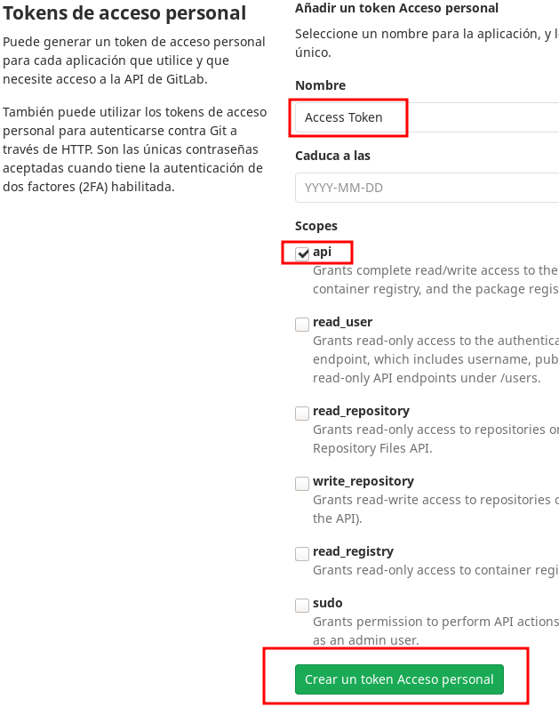

# Requisitos para las prácticas de SXE

## Pasos previos a realizar

Para poder crear los escenarios de las prácticas y realizar las mismas es necesario ejecutar una serie de pasos previos los cuales se detallan a continuación

### Creación de Access token para gitlab

Es necesario que en vuestro usuario de gitlab.iessanclemente.net creéis un token personal para acceder al api.

Para acceder:

[https://gitlab.iessanclemente.net](https://gitlab.iessanclemente.net)

**Usuario y password la del usuario del dominio**

Un vez dentro váis a la Configuración (Settings) de vuestro usuario (icono de la esquina superior derecha), desde ahí:
*  Tokens de aceeso (panel de la izquierda)
*  Indicad el nombre y marcad la casilla "api"
*  Generar el token con el botón "Crear un token de acceso personal"

**IMPORTANTE**: Una vez se haya generado el token guardadlo en un lugar seguro porque no podréis volver a verlo desde la pantalla

### Requisitos del sistema

Para poder realizar la práctica necesitamos ejecutar una distribución GNU/Linux. La recomendada es la última distribución stable de Debian, a día de hoy Debian 10 (buster). El sistema puede ser un host físico (recomendado) o una máquina virtual de Virtual Box.

### Instalación de git

**Git** es un sistema de gestión de **repositorios distribuídos**. Un repositorio es un almacén de información o código que puede ser operado en proyectos de software por equipos de desarrollo. Concretamente git es el sistema más extendido y potente de cuantos existen en la actualidad, además es totalmente libre y es la base de la mayoría de los proyectos de software libre.

Existen además una serie de plataformas para albergar repositorios y así poder compartir el código y colaborar en la construcción del mismo. Dos de estas plataformas, quizás las más conocidas, son **github** y **gitlab**.

En nuestro caso haremos uso de repositorios para publicar las prácticas, es decir, las prácticas se crearán dentro de un repositorio git y por tanto será necesario disponer de esta herramienta instalada en nuestro sistema. Para instalar git en una distribución GNU/Linux basada en Debian (debian, ubuntu...) ejecutamos:

`apt upate`

`apt install -y git`

Por supuesto también existen versiones para Windows y MacOS.

Para descargar (o clonar) un repositorio necesitaremos conocer su URL, supongamos que vamos a descargar el repositorio con URL:

**https://github.com/octocat/Hello-World.git**

`git clone https://github.com/octocat/Hello-World.git`

Una vez termine el comando dispondremos en un directorio que por defecto tendrá el mismo nombre que el repositorio, es decir Hello-World, los contenidos del mismo.

### Instalación de docker engine

Como plataforma de ejecución para las prácticas usaremos docker, por tanto lo primero que necesitamos es docker engine funcionando en nuestro sistema. Podemos instalar docker engine en cualquier distribución de GNU/Linux, MacOS e incluso Windows (aunque en este caso sobre una máquina virtual). Para instalar docker engine en Debian seguimos los pasos siguientes:

#### Instalación de dependencias

`apt install -y apt-transport-https ca-certificates curl gnupg-agent software-properties-common`

#### Añadir repositorio

Primero añadimos la clave del repositorio:

`curl -fsSL https://download.docker.com/linux/debian/gpg | apt-key add -`

A continuación añadimos el repositorio:

`add-apt-repository "deb [arch=amd64] https://download.docker.com/linux/debian $(lsb_release -cs) stable"`

#### Actualizamos e instalamos docker-engine

`apt update`

`apt install -y docker-ce docker-ce-cli containerd.io`

La referencia para la instalación en la documentación oficial:

[Instalación de docker engine en Debian](https://docs.docker.com/engine/install/debian/#install-using-the-repository)

**NOTAS**:
*  En los pasos de la instalación anterior si el comando sudo os da problemas es porque en Debian por defecto no viene instalado. En ese caso eliminad la instrucción sudo de los comandos y ejecutad todo con el usuario root.
*  Una vez finalizada la instalación para poder ejecutar docker engine con un usuario no root, por ejemplo vuestro usuario normal de escritorio, ejecutad el comando siguiente con ese usuario, es decir desde una sesión de terminal del usuario (no de root):

#### Añadir usuario no root al grupo

`usermod -aG docker $USER `

* El comando anterior añade al usuario al grupo docker, con esto podremos ejecutar docker con nuestro usuario de trabajo normal, sin necesidad de autenticarnos con usuario root. A continuación para aplicar los cambios del grupo ejecutamos:

`newgrp docker`

#### Opcional. Interfaz web para gestión de docker containers

Una vez instalado docker engine podríamos lanzar un entorno gráfico de interfaz web para la visualización y gestión básica de los docker container corriendo en el host. Para ello simplemente lanzamos un container basado en la imagen **portainer/portainer**. Ejecutamos:

`docker volume create portainer_data`

el comando anterior crearía un **volumen para almacenar los datos del container**. A continuación lanzamos el container:

`docker run -d -p 9000:9000 --name portainer -v /var/run/docker.sock:/var/run/docker.sock -v portainer_data:/data portainer/portainer`

el comando anterior crear un container de **nombre portainer** que ejecuta el entorno de gestión de docker engine basado en interfaz web.

para acceder entramos al **puerto 9000 del host a través del navegador web**.

### Instalación de docker compose

**docker compose** es una herramienta de **despliegue de containers docker**. Se basa en un fichero declarativo en formato YAML (YAML Aint Markup Language) en el que se indica el entorno de despliegue de los container, es decir, en nuestro caso el escenario de la práctica.
Para instalar docker-compose en Debian ejecutamos los pasos:

`curl -L "https://github.com/docker/compose/releases/download/1.27.1/docker-compose-$(uname -s)-$(uname -m)" -o /usr/local/bin/docker-compose`

`chmod +x /usr/local/bin/docker-compose`

La referencia de instalación en la documentación oficial:

[Instalación de docker-compose en Debian](https://docs.docker.com/compose/install/#install-compose-on-linux-systems)

### Instalación de Ansible

**Ansible** es un herramienta de **automatización de infraestructura**. Se basa en lo que se denomina **infraestructure as code**, es decir definir nuestra infraestructura de sistemas de un modo declarativo muy cercano a la escritura de software. Ansible lo necesitaremos para ejecutar los tests en los containers sobre los que vais a trabajar. La instalación de Ansible en Debian es muy fácil, básicamente se reduce a ejecutar:

`apt update`

`apt -y install ansible`
